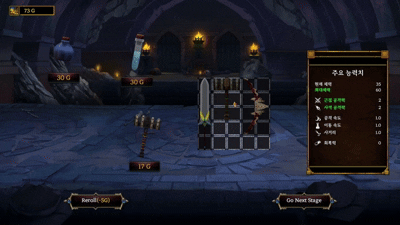
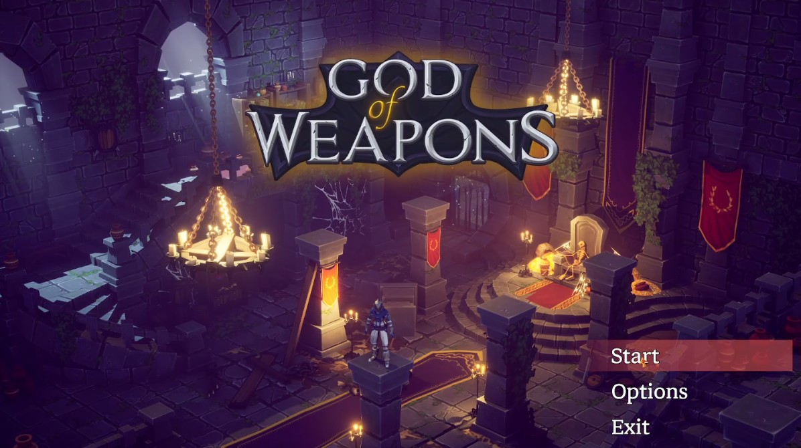
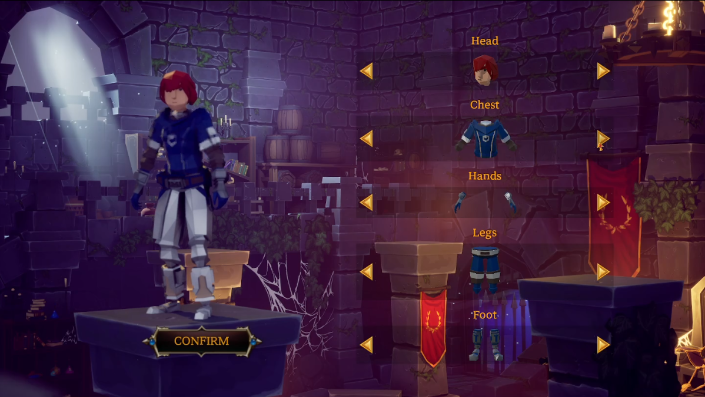
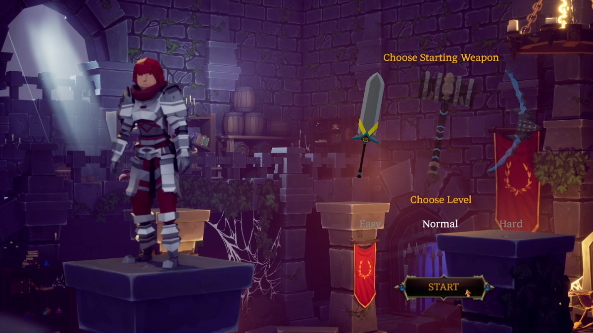
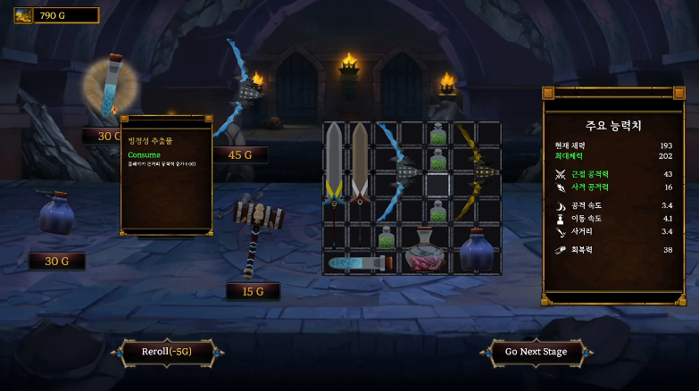

# ⚔️ God of Weapons

> Unreal Engine 5 | C++ & Blueprint | 1인 개발

<br>

## 📋 목차
- [프로젝트 소개](#-프로젝트-소개)
- [시연 영상](#-시연-영상)
- [게임 플레이 흐름](#-게임-플레이-흐름)
- [핵심 시스템](#-핵심-시스템)
  - [몬스터 풀링 & Wave 매니저](#1-몬스터-풀링--wave-매니저)
  - [그리드 인벤토리](#2-그리드-인벤토리)
  - [무기 FSM & 플레이어 장착](#3-무기-fsm--플레이어-장착)
- [추가 구현 시스템](#-추가-구현-시스템)
- [성능 최적화](#-성능-최적화)
- [트러블슈팅](#-트러블슈팅)
- [기술 스택](#-기술-스택)

<br>

---

## 🎮 프로젝트 소개

**God of Weapons**는 웨이브 기반 로그라이크 게임입니다.
플레이어는 전투 후 인벤토리 상점에서 아이템을 구매하고 배치해 빌드를 구성하며, 10개의 웨이브를 클리어하는 것이 목표입니다.

| 항목 | 내용 |
|------|------|
| 엔진 | Unreal Engine 5 |
| 언어 | C++, Blueprint |
| 개발 기간 | 2025.04 ~ 2025.05 |
| 개발 인원 | 1인 |
| 장르 | 로그라이크, 웨이브 디펜스 |

<br>

---

## 🎬 시연 영상

[](https://www.youtube.com/watch?v=QICtBL-JYYA&t=40s)

> 이미지를 클릭하면 유튜브 영상으로 이동합니다.

<br>

### 인게임 전투


### 인벤토리


<br>

---

## 🗺️ 게임 플레이 흐름

### 타이틀 화면


### 커스터마이징
머리, 가슴, 팔, 다리, 발 5개 부위를 DataTable 기반으로 실시간 스켈레탈 메시 스왑하여 적용합니다.



### 스타팅 무기 & 난이도 선택
검 / 해머 / 활 중 하나를 선택하고 Easy / Normal / Hard 난이도를 설정합니다.



### 인벤토리 & 상점
웨이브 클리어 후 획득한 골드로 아이템을 구매하고 그리드에 배치합니다.



<br>

---

## ⚙️ 핵심 시스템

### 1. 몬스터 풀링 & Wave 매니저

게임 시작 시 최대 등장 수만큼 몬스터를 미리 생성해 비활성 상태로 보관하고, 필요할 때 꺼내 쓰고 반환하는 오브젝트 풀링 구조입니다.

**핵심 구조**
- `UPoolManagerComponent` — `TMap<FName, FMonsterPool>` 구조로 몬스터 종류별 풀 관리
- `UWaveManagerComponent` — DataTable에서 스테이지별 웨이브 데이터 읽기 및 스폰 타이머 제어

**Wave → Pool 데이터 전달**
```cpp
// WaveManagerComponent.cpp
FWaveData* FindRow = WaveDataTable->FindRow<FWaveData>(RowName, TEXT("WaveData"));
if (FindRow)
{
    SpawnMonsterNames = FindRow->SpawnMonsters;  // 등장할 몬스터 종류
    MaxAliveCount     = FindRow->SpawnCount;     // 최대 동시 생존 수
}
PoolManagerRef->InitPool(SpawnMonsterNames, MaxAliveCount);
```

**Pool 저장 / 대여 / 반환**
```cpp
// PoolManagerComponent.cpp

// [저장] SpawnActorDeferred로 BeginPlay 이전에 스탯 주입 후 비활성화
ABaseMonster* NewMonster = GetWorld()->SpawnActorDeferred<ABaseMonster>(...);
NewMonster->SetBaseMonsterStat(InStat);
UGameplayStatics::FinishSpawningActor(NewMonster, SpawnTransform);
NewMonster->DisableMonster();  // Hidden / Collision Off / Tick Off
NewPool.PoolList.Add(NewMonster);

// [대여] IsHidden() 체크만으로 가용 여부 판단
for (ABaseMonster* Monster : FoundPool->PoolList)
    if (Monster && Monster->IsHidden()) return Monster;

// [반환] DisableMonster() 후 카운트 감소
InMonster->DisableMonster();
InGameMode->WaveManagerComp->DecreaseCurrentAliveCount();
```

> 📁 관련 코드 : [`Source/Components/PoolManagerComponent.cpp`](https://github.com/batminji/Project_GodOfWeapon/blob/main/Source/Project_GodOfWeapon/Components/PoolManagerComponent.cpp) · [`WaveManagerComponent.cpp`](https://github.com/batminji/Project_GodOfWeapon/blob/main/Source/Project_GodOfWeapon/Components/WaveManagerComponent.cpp)

<br>

---

### 2. 그리드 인벤토리

타일 기반 그리드에 아이템을 배치하고, 드래그 앤 드롭으로 이동, R키로 회전, 상점에서 구매 후 즉시 배치하는 인벤토리 시스템입니다.

**핵심 구조**
- `UInventoryComponent` — `TArray<UItemWidget*>`으로 1차원 배열 저장, `IndexToTile` / `TileToIndex`로 2D ↔ 1D 상호 변환
- `UInventoryGridWidget` — 드래그 입력 처리, `NativePaint`로 Slate 기반 드롭 프리뷰 렌더링

**배치 가능 여부 검사 — 아이템 Dimension만큼 2D 순회**
```cpp
// InventoryComponent.cpp
bool UInventoryComponent::IsRoomAvailable(UItemWidget* InItemWidget, int32 TopLeftIndex) const
{
    FIntPoint Dimensions = InItemWidget->GetDimensions();
    FIntPoint Tile = IndexToTile(TopLeftIndex);

    for (int32 i = Tile.X; i < Tile.X + Dimensions.X; ++i)
    {
        for (int32 j = Tile.Y; j < Tile.Y + Dimensions.Y; ++j)
        {
            if (!IsTileValid(FIntPoint(i, j)))  return false; // 그리드 범위 밖
            int32 Index = TileToIndex(FIntPoint(i, j));
            if (!GetResultAtIndex(Index))        return false; // 배열 범위 밖
            if (GetItemWidgetAtIndex(Index))     return false; // 이미 점유된 타일
        }
    }
    return true;
}
```

**인벤토리 크기 변경에도 아이템 위치 보존 — 인덱스 대신 좌표로 저장**
```cpp
// InventoryComponent.cpp
void UInventoryComponent::SaveInventoryToGameInstance()
{
    TMap<UItemWidget*, FIntPoint> AllItems = GetAllItemWidgets();
    for (auto& Item : AllItems)
    {
        FSavedItemData Data;
        Data.ItemRowName = Item.Key->ItemData.ItemID;
        Data.TopLeftTile = Item.Value;       // 인덱스가 아닌 (X, Y) 좌표로 저장
        Data.bIsRotated  = Item.Key->GetIsRotated();
        GameInstance->GetInventoryData().Add(Data);
    }
}
```

> 📁 관련 코드 : [`Source/Components/InventoryComponent.cpp`](https://github.com/batminji/Project_GodOfWeapon/blob/main/Source/Project_GodOfWeapon/Components/InventoryComponent.cpp) · [`UI/Inventory/InventoryGridWidget.cpp`](https://github.com/batminji/Project_GodOfWeapon/blob/main/Source/Project_GodOfWeapon/UI/Inventory/InventoryGridWidget.cpp)

<br>

---

### 3. 무기 FSM & 플레이어 장착

각 무기가 `USpringArmComponent`와 `UChildActorComponent`를 통해 플레이어에 부착되고, 독립적인 FSM으로 자율 동작하는 시스템입니다.

**장착 흐름**
```
AddChildActorComponent       // 빈 컴포넌트 생성 및 SpringArm에 부착
→ SetChildActorClass         // 실제 무기 클래스 할당
→ GetChildActor              // 인스턴스 획득
→ Cast<ABaseItemActor>       // 형변환
→ SetPlayer() + InitItem()   // 스탯, 메시, SpringArm / ChildActor 레퍼런스 주입
```

**근접 무기 FSM (5-State)**

| 상태 | 설명 |
|------|------|
| `Idle` | SpringArm에 붙어 플레이어 추종 |
| `Approach` | SpringArm 디태치 후 가장 가까운 몬스터로 이동 |
| `Attack` | ActorSequence 실행, 시퀀서 노티파이로 종료 감지 |
| `Returning` | SpringArm 소켓 위치로 복귀 후 재어태치 |
| `Cooldown` | `CooldownTime / AttackSpeed` 타이머 대기 |

**Tick 기반 FSM 진입점**
```cpp
// BaseItemActor.cpp
void ABaseItemActor::Tick(float DeltaTime)
{
    switch (ItemCurrentState)
    {
    case EItemState::Idle:
        Idle(); // BlueprintImplementableEvent — Idle 상태에서만 전이 조건 검사
        break;
    // Approach 이후는 Timeline Finished / Sequencer Notify 이벤트로 전이
    }
}
```

> 📁 관련 코드 : [`Source/Item/BaseItemActor.cpp`](https://github.com/batminji/Project_GodOfWeapon/blob/main/Source/Project_GodOfWeapon/Item/BaseItemActor.cpp) · [`Source/Item/BaseItemActor.h`](https://github.com/batminji/Project_GodOfWeapon/blob/main/Source/Project_GodOfWeapon/Item/BaseItemActor.h)

<br>

---

## 🧩 추가 구현 시스템

### DataTable 드리븐 설계

게임 내 모든 데이터를 코드에 하드코딩하지 않고 DataTable로 외부 관리해 코드 수정 없이 밸런싱과 콘텐츠 추가가 가능한 구조로 설계했습니다.

| DataTable | 구조체 | 용도 |
|-----------|--------|------|
| DT_ItemData | `FItemData` | 아이템 타입, 스탯, 메시, 나이아가라, 가격, 그리드 크기 |
| DT_MonsterData | `FMonsterData` | 몬스터 클래스, 기본 스탯 |
| DT_WaveData | `FWaveData` | 스테이지별 등장 몬스터, 스폰 간격, 타이머, 스탯 배율 |
| DT_CustomHead ~ DT_CustomFoot | `S_Customize` | 각 부위별 커스터마이징 스켈레탈 메시 |
| DT_Level | `S_Level` | 난이도별 배율 |

에셋 참조는 `TSoftClassPtr` / `TSoftObjectPtr`로 선언해 게임 시작 시 메모리에 올라오지 않도록 하고, 필요한 시점에만 로드해 사용합니다.

<br>

### 캐릭터 커스터마이징

머리, 가슴, 팔, 다리, 발 5개 부위를 각각 DataTable로 관리하며, 좌우 화살표로 선택 시 스켈레탈 메시를 실시간으로 스왑해 미리보기를 제공합니다. 확정된 커스터마이징 데이터는 `UGodOfWeaponGameInstance`에 저장되어 인게임에서 그대로 적용됩니다.

<br>

### 몬스터 AI

Behavior Tree와 Blackboard를 기반으로 동작하며, 몬스터 종류에 따라 행동 패턴이 다릅니다.

| 종류 | 행동 패턴 |
|------|-----------|
| 근접형 | 플레이어에게 직접 접근해 근접 공격 |
| 원거리형 | 일정 거리를 유지하며 발사체 공격 |

스폰 시 스폰 애니메이션이 끝난 후에만 AI가 행동을 시작하며, 사망 시 다이 애니메이션 종료 노티파이를 받아 비활성화 처리 후 풀에 반환합니다.

<br>

### 스테이지 진행 및 보상 시스템

- 3스테이지마다 플레이어 HP가 회복되고 인벤토리 크기가 가로 또는 세로 방향으로 랜덤하게 1칸 확장됩니다.
- 몬스터 처치 시 보상 골드만큼 코인 액터를 스폰하며, 획득한 골드로 인벤토리 상점에서 아이템을 구매할 수 있습니다.
- 상점 아이템은 매 스테이지 5개가 랜덤으로 등장하며, 추가 골드를 소비해 Reroll이 가능합니다.

<br>

### 게임 인스턴스 기반 데이터 유지

`UGodOfWeaponGameInstance`를 통해 맵 전환 시에도 플레이어 스탯, 인벤토리 데이터, 골드, 누적 처치 수, 누적 데미지가 유지됩니다. 게임 오버 화면에서 이 데이터를 기반으로 스테이지, 처치 수, 총 데미지, 획득 골드 결과를 표시합니다.

<br>

---

## 🚀 성능 최적화

### 범위 감지 구조 개선
기존 `USphereComponent`를 물리 씬에 상시 등록하던 방식을 `OverlapAnyTestByObjectType` / `OverlapMultiByObjectType` 쿼리로 교체해 컴포넌트를 물리 씬에서 완전히 제거하고, 필요한 시점에만 쿼리를 수행하도록 변경했습니다. `ECC_GameTraceChannel2` 전용 채널을 지정해 몬스터 오브젝트만 선별 검사합니다.

```cpp
FCollisionObjectQueryParams ObjectQueryParams;
ObjectQueryParams.AddObjectTypesToQuery(ECC_GameTraceChannel2);
GetWorld()->OverlapMultiByObjectType(OverlappingResults, GetActorLocation(),
    FQuat::Identity, ObjectQueryParams,
    FCollisionShape::MakeSphere(ItemStat.AttackRange), CollisionParams);
```

### 거리 비교 연산 최적화
최솟값 비교 루프에서 `GetDistanceTo()` 대신 `FVector::DistSquared()`를 사용해 제곱근 연산을 제거했습니다.

```cpp
float DistanceSquared = FVector::DistSquared(GetActorLocation(), HitActor->GetActorLocation());
if (DistanceSquared < NearestLength) { ... }
```

### 소프트 레퍼런스 지연 로딩
커스터마이징·아이템 에셋을 `TSoftObjectPtr` / `TSoftClassPtr`로 선언해 초기 메모리 점유를 줄이고, `LoadClassAsset_Blocking` / `LoadAsset_Blocking`으로 필요한 시점에만 로드합니다.

### 기타
- UI 텍스처 No Mipmap 설정으로 불필요한 텍스처 메모리 절약
- 오버랩만 필요한 컴포넌트는 Query Only로 설정해 물리 시뮬레이션 비용 제거

<br>

---

## 🛠️ 트러블슈팅

### 1. SpawnActorDeferred와 AIController 빙의 타이밍 문제

**문제** : `EnableMonster()` 호출 시 `AIController`가 null이어서 `RunAI()`가 실행되지 않음

**원인** : `SpawnActorDeferred`는 `FinishSpawningActor()` 호출 전까지 `BeginPlay()`와 Auto Possess가 실행되지 않음. `FinishSpawningActor()` 없이 `DisableMonster()`를 호출하면 AIController가 없는 상태로 풀에 등록됨

**해결** : 초기화 순서 재정리

```cpp
ABaseMonster* NewMonster = GetWorld()->SpawnActorDeferred<ABaseMonster>(...);
NewMonster->SetBaseMonsterStat(InStat);                            // 1. 스탯 주입
UGameplayStatics::FinishSpawningActor(NewMonster, SpawnTransform); // 2. BeginPlay + PossessedBy 실행
NewMonster->DisableMonster();                                      // 3. 비활성화 후 풀 등록
NewPool.PoolList.Add(NewMonster);
```

<br>

### 2. 무기 부착 구조 설계 — Actor / Component / ChildActor

**1차 고민** : `SpawnActor`로 월드에 배치 후 Tick마다 플레이어 위치를 추적하는 방식을 고려했으나, 매 프레임 위치를 계속 참조해야 하는 비용과 다른 로직과 충돌 가능성을 우려해 SpringArm 종속 방식으로 전환

**2차 시도** : `UStaticMeshComponent`로 SpringArm에 부착. 그러나 무기별 `ActorSequenceComponent`를 붙일 수 없어 공격 모션 구현이 불가능했고, 몬스터 탐지·FSM·이펙트를 모두 처리하는 독립 로직 주체가 필요하다고 판단해 Actor 기반으로 전면 수정

**해결** : `UChildActorComponent` 활용. `ExposeOnSpawn`이 지원되지 않는 문제는 `SetChildActorClass` 후 `Cast<ABaseItemActor>` → `InitItem()` 명시적 호출로 해결

```
AddChildActorComponent → SetChildActorClass → GetChildActor
→ Cast<ABaseItemActor> → SetPlayer() + InitItem()
```

---

> 읽어주셔서 감사합니다.
